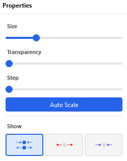
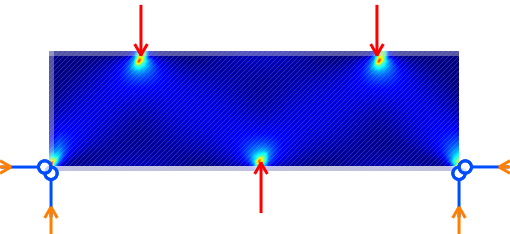
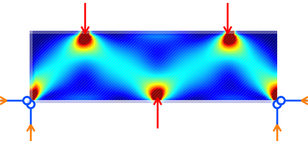
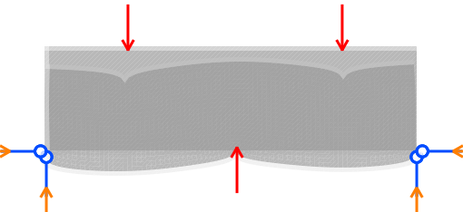
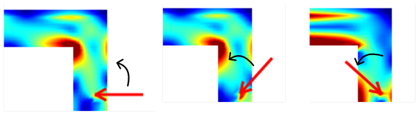
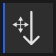
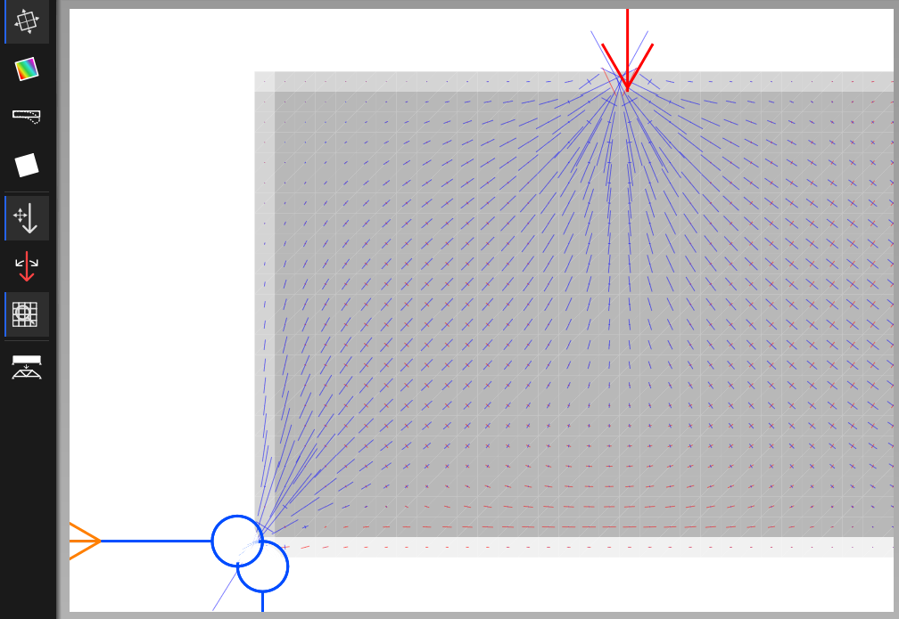
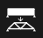
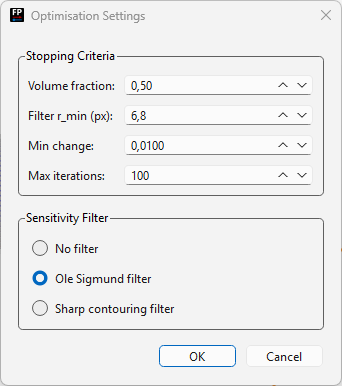

# Action Mode

Action mode displays the results of the finite element analysis and allows interactive exploration of the structure's behaviour. Switch to this mode using the **Action** tab below the main menu bar.

The FEM calculation runs automatically when action mode is first entered. Results are updated in real-time when forces are moved or rotated.

## Visualization modes

The left toolbar in action mode selects which result quantity is displayed. The right pane updates to show the relevant display controls.

### Principal stresses

Principal stress visualization is the default when action mode is activated. Select the **principal stress tool** in the left toolbar.

Result arrows are drawn across the structure:

- **Red arrows** — tensile stresses (pulling apart)
- **Blue arrows** — compressive stresses (pushing together)

The right toolbar provides the following controls:

| Control | Effect |
| --- | --- |
| **Size** roller | Scale the size of the stress arrows |
| **Transp** roller | Transparency of the arrows (reduce to better see the structure underneath) |
| **Step** roller | Number of grid steps between arrows — increasing reduces arrow density |
| **AutoScale** button | Automatically recalculate arrow sizes each time action mode is entered |
| Tensile/compressive toggles | Show only tensile, only compressive, or both stress arrows |

The example below shows the effect of increasing the step size to reduce arrow density:

### Von Mises stress

Select the second button in the left toolbar to display the von Mises stress field as a color map.

Two color maps are available:

- **Rainbow** (default) — low stresses shown in blue, high stresses in red.
- **Hot** — low stresses shown in dark red, high stresses in yellow.

A slider controls the stress level that maps to the maximum color, allowing you to compress or expand the color range. For example, reducing the slider value makes it easier to see low-stress regions in detail. See the example below:

### Displacement

Select the displacement tool in the left toolbar to visualize structural deformations. 

A slider in the right toolbar scales the magnitude of the displayed displacements. The following example shows the effect of increasing the displacement scale:

## Interacting with forces in real-time

Action mode allows forces to be rotated and moved while the visualization updates immediately.

### Rotating forces

When action mode is first entered, ForcePAD is in **force rotation** mode. Click on the tip of a force arrow and drag with the left mouse button to rotate the force, see figure below. The visualization updates in real-time.

### Moving forces

Select the **force movement tool** button in the left toolbar. Click on a force tip and drag to relocate the force application point. Results update continuously.

## Magnifying the view

To examine visualizations in detail, activate the **zoom / magnify** button in the left toolbar. The view is immediately magnified. Adjust the zoom level with the scroll wheel or the **Page Up** / **Page Down** keys. Drag the mouse to pan the magnified view. The figure below shows the magnify tool in action:

## Topology optimisation

ForcePAD includes a topology optimizer (Sigmund filter) that derives an efficient structural shape from the current design domain, forces, and constraints.

To run the optimizer click on the optimise tool button in the left toolbar. 

A dialog appears where you can adjust the optimization parameters (volume fraction, filter radius, penalty factor). 

Click **OK** to start the optimization process. The optimizer runs iteratively, updating the displayed shape at each step. You can stop the optimization early by clicking the red **Stop** button in the status bar of the window.

The finished optimization is shown in the example below:

