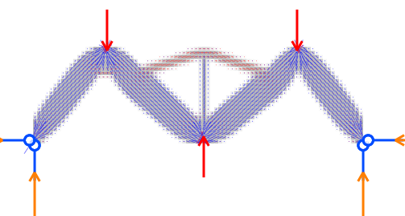
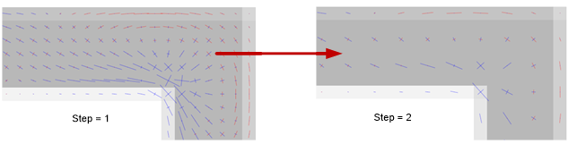

# Examples

ForcePAD includes small `.fp2` models that can be used as starting points for teaching, demonstrations, and regression testing. The current sample files live in the repository under `bin/release/samples/`.

!!! note "Curated example placeholder"
    Add screenshots, expected result images, and short lesson notes for each example. The first high-value set should cover a cantilever beam, bridge or truss-like domain, stress concentration, topology optimisation, and an image-based model.

## Bundled Sample Models

| Example | File | Suggested use |
| --- | --- | --- |
| Symmetric beam | [`beam_sym.fp2`](https://github.com/jonaslindemann/forcepad/blob/master/bin/release/samples/beam_sym.fp2) | Basic bending, support conditions, and symmetry. |
| Thick beam | [`thick_beam.fp2`](https://github.com/jonaslindemann/forcepad/blob/master/bin/release/samples/thick_beam.fp2) | Compare coarse and thick structural domains. |
| Block | [`block.fp2`](https://github.com/jonaslindemann/forcepad/blob/master/bin/release/samples/block.fp2) | Simple design domain for stress and optimisation experiments. |
| Demo example | [`demo_example.fp2`](https://github.com/jonaslindemann/forcepad/blob/master/bin/release/samples/demo_example.fp2) | General walkthrough model for demonstrations. |
| Pantheon | [`pantheon.fp2`](https://github.com/jonaslindemann/forcepad/blob/master/bin/release/samples/pantheon.fp2) | Image-based geometry and architectural form exploration. |
| Pantheon variants | [`pantheon2.fp2`](https://github.com/jonaslindemann/forcepad/blob/master/bin/release/samples/pantheon2.fp2), [`pantheon3.fp2`](https://github.com/jonaslindemann/forcepad/blob/master/bin/release/samples/pantheon3.fp2) | Variants for comparing edits and responses. |

## Example Walkthroughs to Add

These are placeholders for future example pages or downloadable teaching packs.

### Cantilever Beam

Goal: show bending deformation, tensile/compressive stress regions, and the effect of moving the load.

Recommended assets to add:

- `examples/cantilever-beam.fp2`
- screenshot in Sketch mode
- screenshot in Action mode with displacement visualization
- 5-second GIF of moving the load

### Stress Concentration Plate

Goal: show how holes, sharp corners, and narrow regions influence von Mises stress.

Recommended assets to add:

- `examples/stress-concentration.fp2`
- screenshot with von Mises stress
- short note explaining why the stress field changes near geometric discontinuities

### Topology Optimisation Domain

Goal: show a rectangular design domain evolving into an efficient structural layout.

Recommended assets to add:

- `examples/topology-optimisation.fp2`
- before/after screenshots
- short GIF of the optimiser iterations

### Load Path Exploration

Goal: help students understand how load direction and support placement change principal stress directions.

Recommended assets to add:

- `examples/load-path.fp2`
- screenshot with principal stress arrows
- GIF of rotating the force in Action mode

## Suggested Top-Level Examples Directory

For GitHub discoverability, a future cleanup could move curated examples into a top-level `examples/` directory and keep installer-specific copies under `bin/release/samples/`.
