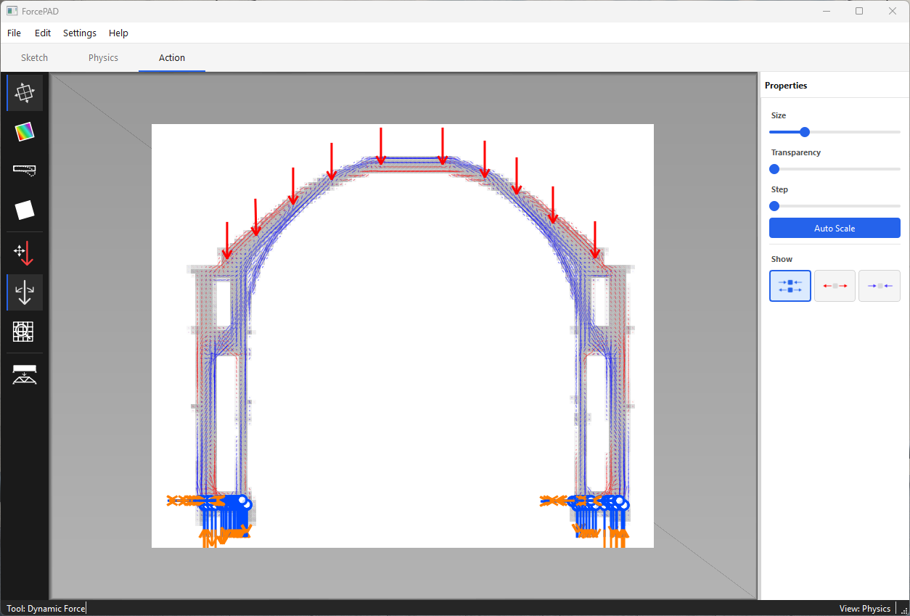

# Welcome to ForcePAD

ForcePAD is an educational sketch-based 2D finite element analysis application developed at Structural Mechanics, Lund University. The application lets you draw structural shapes with a brush — just like a paint program — and immediately see how they respond to forces and constraints. Stresses and displacements are calculated and visualized in real-time without delays.

The design follows the same conceptual model as familiar image-editing applications such as Microsoft Paint or The GIMP: structures are drawn with pens and fill tools, forces and constraints are placed with mouse clicks, and results are shown instantly.

## Modes

ForcePAD operates in three main modes:

- **Sketch mode** — draw the structure using pens, geometric shapes, and fill tools.
- **Physics mode** — place forces and boundary constraints on the structure.
- **Action mode** — visualize principal stresses, von Mises stresses, and displacements; run topology optimization.

On this page you will find information on [downloading](download.md), [using](use.md), and [building](develop.md) ForcePAD.

Test
