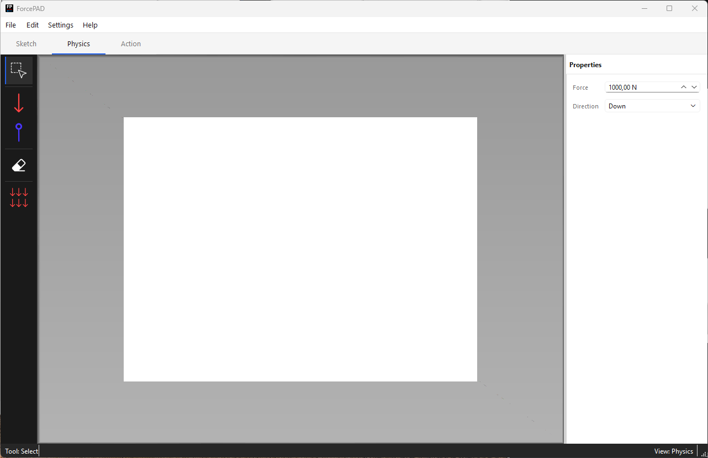
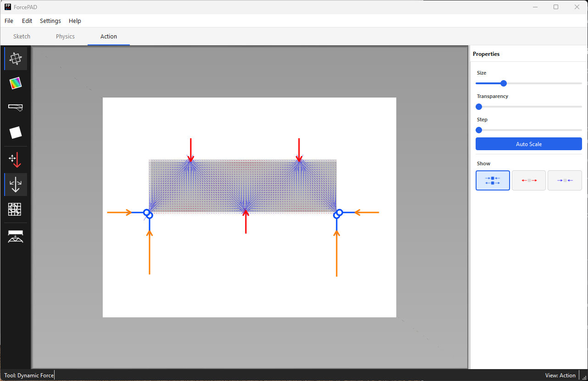

# ForcePAD

Sketch structures and instantly explore how they deform, carry forces, and develop stresses.

ForcePAD is an open-source, sketch-based 2D finite element analysis tool for structural mechanics education. Draw a shape like in a paint program, add loads and supports, and see stresses and displacements update interactively.

[Download ForcePAD](download.md){ .md-button .md-button--primary }
[Quick start](quick-start.md){ .md-button }
[Examples](examples.md){ .md-button }

!!! note "Animation placeholder"
    Add a short animated GIF or MP4 here showing the core ForcePAD workflow: sketch material, place supports, apply a force, switch to Action mode, and move the force while stresses update.

## Why ForcePAD?

- **Sketch-based modelling**: draw structural domains with brushes, fills, lines, rectangles, ellipses, and image-like editing tools.
- **Immediate structural feedback**: inspect displacements, principal stresses, and von Mises stresses without a complex CAD workflow.
- **Interactive force exploration**: move or rotate forces in Action mode and see the response update.
- **Topology optimisation**: experiment with efficient structural layouts directly from a sketched design domain.
- **Educational FEM focus**: useful for teaching finite element analysis, structural mechanics, stress flow, and deformation behaviour.
- **Open source**: GPL-2 licensed C++ code with Qt, OpenGL, Eigen, and a C++ CALFEM implementation.

## Quick Start in 60 Seconds

1. [Download](download.md) the latest release.
2. Create a new model or open a bundled example.
3. Draw a structure in [Sketch mode](sketch-mode.md).
4. Add constraints and forces in [Physics mode](physics-mode.md).
5. Inspect stresses, deformations, and optimisation results in [Action mode](action-mode.md).

## What You Can Explore

| Topic | ForcePAD workflow |
| --- | --- |
| Beam bending | Sketch a beam, constrain one side, add a load, and inspect displacement. |
| Stress concentrations | Add openings or sharp corners and compare von Mises stress fields. |
| Load paths | Move forces and watch principal stress directions change. |
| Support conditions | Change boundary constraints and compare deformation patterns. |
| Topology optimisation | Start with a design domain and let ForcePAD derive an efficient structure. |

## Examples

ForcePAD includes sample `.fp2` models for beams, blocks, thick domains, and image-based structures. See the [Examples](examples.md) page for links and placeholders for future curated teaching examples.

## For Students and Teachers

ForcePAD is strongest when it is used as an exploratory teaching tool: ask "what changes if..." and see the answer immediately. The [student guide](students.md) collects small experiments for learning finite element behaviour, stress visualization, and structural deformation.

## Cite This Project

If ForcePAD supports your teaching, research, or publication, see [Cite ForcePAD](cite.md) for a suggested citation and BibTeX entry.
