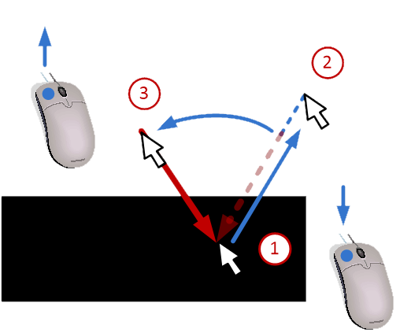
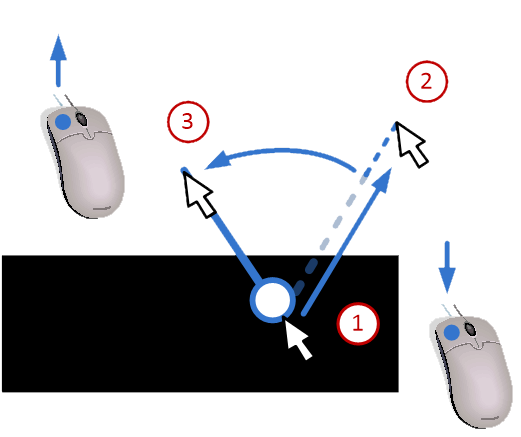

# Physics Mode

In physics mode you place forces and boundary constraints on the structure drawn in sketch mode. Switch to this mode using the **Physics** tab below the main menu bar. 

Placement of both forces and constraints is a two-step click interaction: the first click sets the position, and dragging while holding the button down sets the direction.

## Creating forces

Forces are created by selecting the **force tool** in the left toolbar.

To create a force:

1. Click on the point in the structure where the force should act.
2. While holding the mouse button down, move the mouse to set the direction of the force.
3. Release the mouse button to confirm.

The procedure is illustrated in the example below:

The force arrow appears at the selected position and angle. Multiple forces can be placed in the same way.

## Creating constraints

Constraints are created by selecting the **constraints tool** in the left toolbar.

To create a constraint:

1. Click on the point where the constraint should be applied.
2. While holding the mouse button down, move the mouse to set the constraint direction.
3. Release the mouse button to confirm.

The procedure is illustrated in the example below:

Constraints are visualized with a support symbol at the applied position.

!!! note
    Both forces and constraints should be placed on or near the drawn structure (non-white pixels). Placing them on empty (white) areas will have no effect on the FEM calculation.

## Erasing forces and constraints

To remove a force or constraint, select the **erase tool** in the left toolbar.

To erase click on the force or constraint you want to delete. You can also click and drag to erase multiple forces or constraints at once.

## Adding self-weight

Self-weight can be added to the model by enabling **self-weight** in the left toolbar.

When enabled, the weight of the structure is automatically calculated based on the stiffness values and applied as a distributed load in the FEM solver. This simulates the effect of gravity on the structure.

