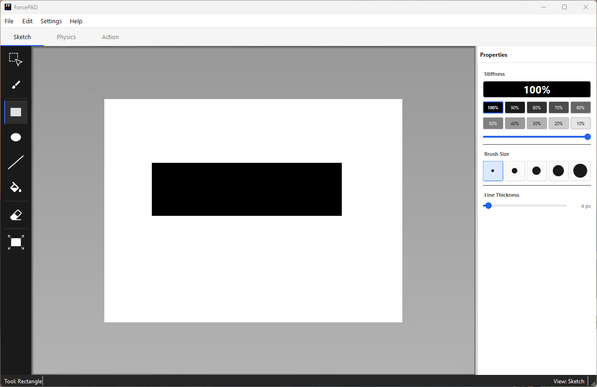
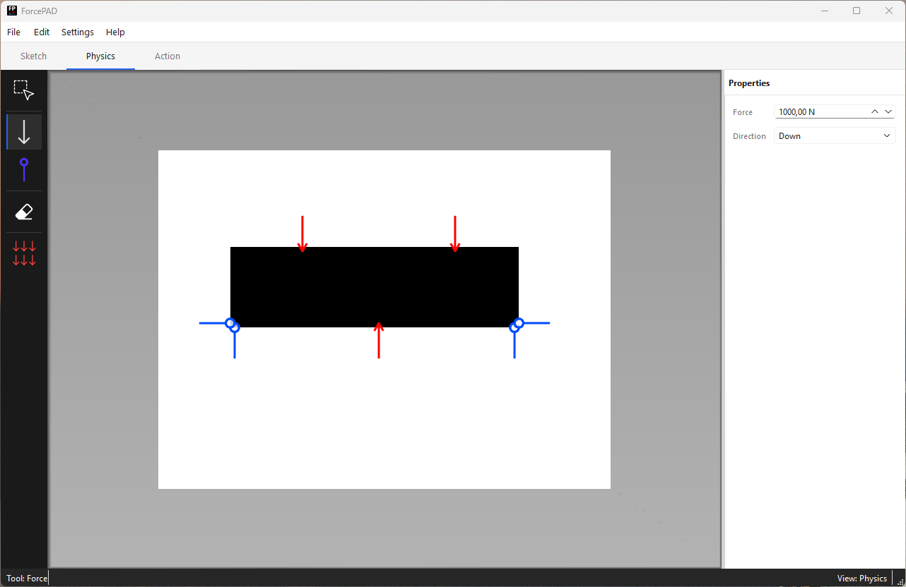
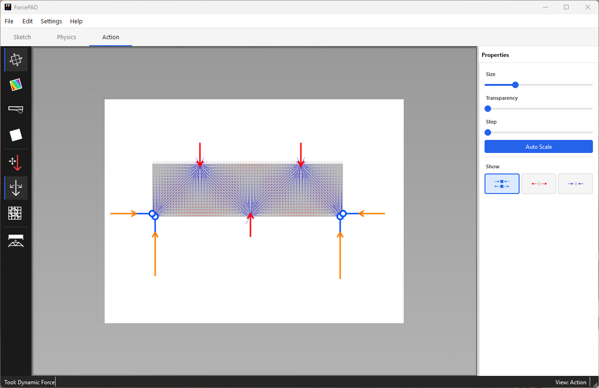
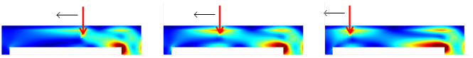

# Quick Start in 60 Seconds

This page is the shortest path from installing ForcePAD to seeing a finite element result.

## 1. Download ForcePAD

Download the latest release from GitHub:

[Latest release](https://github.com/jonaslindemann/forcepad/releases/latest){ .md-button .md-button--primary }

On Windows, run the installer and start ForcePAD from the Start menu.

## 2. Create or Open a Model

Choose **File -> New** to create a blank model, or open one of the bundled `.fp2` examples from the installation directory.

## 3. Sketch the Structure

Use [Sketch mode](sketch-mode.md) to paint the structural domain. Black pixels represent full stiffness, white pixels represent empty space, and grey values represent intermediate stiffness.

## 4. Add Supports and Forces

Switch to [Physics mode](physics-mode.md). Place constraints where the structure is supported, then place forces where loads should act.

## 5. Inspect Results

Switch to [Action mode](action-mode.md). ForcePAD calculates the response and visualizes principal stresses, von Mises stress, or displacement.

## 6. Try Real-Time Interaction

In Action mode, drag a force tip to rotate or move the force. The structural response updates interactively.

!!! note "Animation placeholder"
    Add a 5-10 second GIF showing a force being moved or rotated while the stress visualization updates.

## Next Steps

- Open a sample model from the [Examples](examples.md) page.
- Learn the three main modes in the [User guide](use.md).
- Try a teaching experiment from [For Students](students.md).
- Watch a short demo on the [Videos](videos.md) page once the videos are published.
