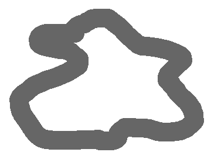
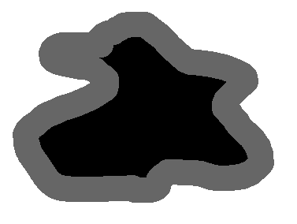
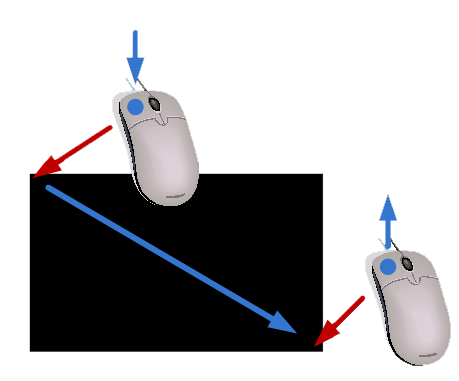
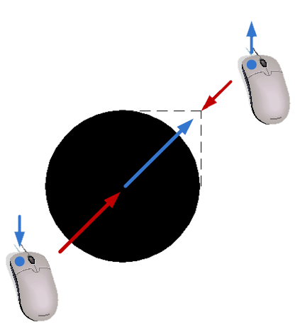
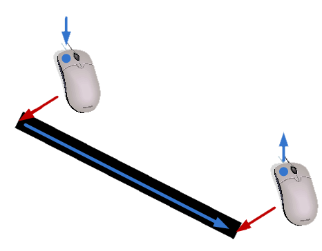
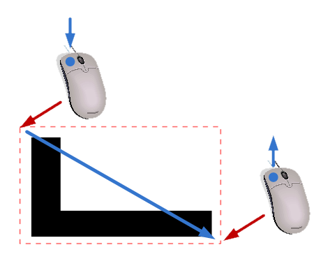
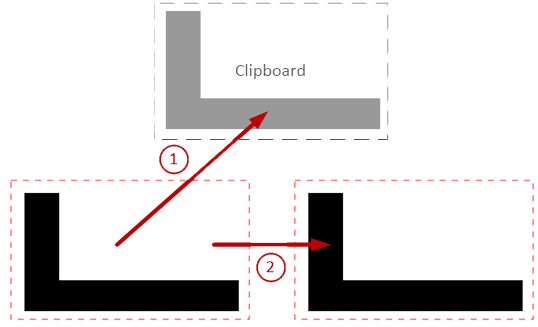
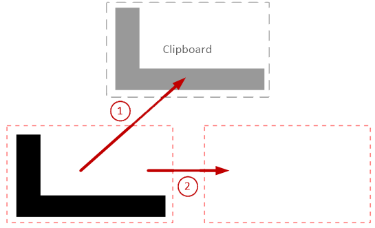
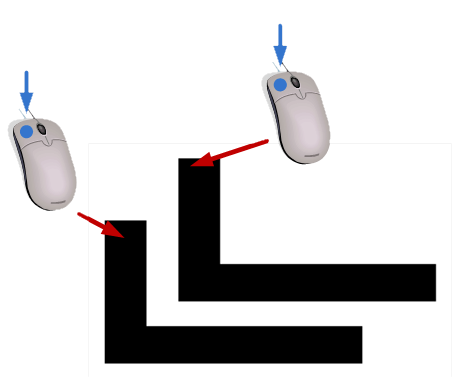
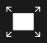

# Sketch Mode

In sketch mode the analysed structure is defined by painting stiffness onto the canvas. Black represents 100% stiffness (solid material) and white represents 0% stiffness (void). Any gray value in between is treated as a proportionally reduced stiffness.

Sketch mode is selected using the **Sketch** tab below the main menu bar. The left toolbar shows the drawing tools, and the right toolbar shows the properties for the currently selected tool.

## Drawing with the brush tool

The brush tool is the primary way to draw structures. Select the **brush tool** in the left toolbar.

The right pane shows the properties for the brush tool:

- **Stiffness** — click one of the grayscale buttons to choose the stiffness value (black = 100%, white = 0%) or use the slider for finer control.
- **Brush size** — click one of the five circles to select the pen thickness.

Draw by moving the cursor over the canvas while holding the **left mouse button** down. The pen leaves a trace with the selected stiffness and thickness.

The **eraser tool** works identically to the pen tool but always uses 0% stiffness (white), removing material.

## Filling surfaces

To fill a closed region with a uniform stiffness, use the **flood fill tool** from the left toolbar.

To fill an area:

1. Select the stiffness in the right property toolbar.
2. Click inside the closed region with the left mouse button.

The fill spreads from the clicked point until it reaches the boundary of the region as shown in the example below:

## Geometric tools

The geometric tools category (left toolbar) provides shape drawing tools for quickly creating regular shapes.

### Rectangle tool

Click to set the start corner, drag with the left mouse button, and release at the opposite corner. The rectangle is drawn with the currently selected stiffness.

### Circle / ellipse tool

Click to set the start point, drag, and release at the end point. The bounding box of the drag defines the ellipse.

### Line tool

Click to set the start point, drag, and release at the end point. Line thickness is controlled by the pen size setting.

## Using the drawing grid

For more precise drawings the cursor can snap to a grid. Snap is activated by holding the **Shift** key while drawing. The grid spacing matches the calculation grid set in **Settings → Calculation…**. This ensures that drawn features align with the finite element mesh, improving the accuracy of results and visualizations.

## Cut, Copy, and Paste

ForcePAD has a basic clipboard for moving or duplicating parts of the drawing.

First, switch to the **selection task** in the left toolbar. 

Create a selection by clicking the start point, dragging, and releasing at the end point. A selection box appears over the canvas.

With a selection active, you can use the edit menu or keyboard shortcuts to perform the following actions:

- **Copy (Ctrl-C)** — copies the pixels inside the selection to the ForcePAD clipboard, leaving the drawing unchanged.
- **Cut (Ctrl-X)** — copies the pixels to the clipboard and replaces them with white (no stiffness) on the canvas.
- **Paste** — the clipboard contents appear under the cursor. Move them to the desired position and click the left mouse button to stamp a copy onto the canvas. Multiple clicks paste multiple copies.

The copy operation is illustrated in the example below:

This creates a duplicate of the selected area. The original remains unchanged.

The cut operation is similar but removes the original pixels:

Finally pasting is performed by using the paste mode in the selection tool:

Clicking the canvas stamps a copy of the clipboard contents at the clicked location. Multiple clicks create multiple copies.

## Expanding the workspace

When the ForcePAD window is resized the drawing surface does not automatically resize. To expand the surface to fill the new window click the **expand workspace** button in the right toolbar.

The existing drawing is copied to the lower-left corner of the expanded canvas.
