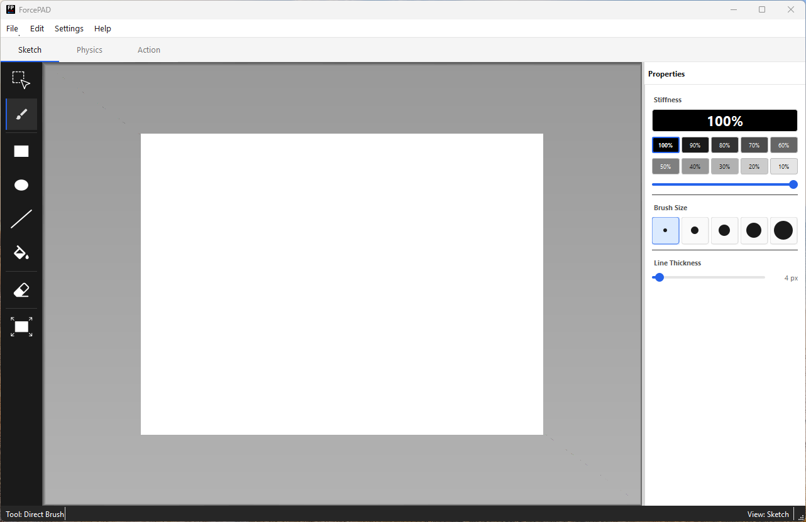
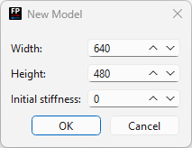

# Using ForcePAD

## User guide map

ForcePAD operates in three main modes. Each mode is covered in its own page:

- [Sketch mode](sketch-mode.md) — draw the structural shape using pens, fill tools, and geometric shapes.
- [Physics mode](physics-mode.md) — place forces and boundary constraints on the structure.
- [Action mode](action-mode.md) — visualize results, run the topology optimizer, and interact with forces in real-time.

This page covers the overall interface, file handling, and calculation settings.

## Main window

When ForcePAD starts, the main workspace is displayed. The workspace is your drawing canvas where you build the structure by painting stiffness values. Black pixels represent full stiffness; white pixels represent no material.

The interface is task-oriented: the **left toolbar** contains the main task categories (drawing tools, physics tools, result tools), and the **right toolbar** shows the properties and settings for the currently selected category.

Mode switching is done using the tabs below the main menu bar. The three modes are Sketch, Physics, and Action.

| Tab | Mode |
| --- | --- |
| Sketch | Draw/edit the structural shape |
| Physics | Place forces and constraints |
| Action | View results and run optimization |

## Creating a new model

Select **File → New** to create a new model. A dialog appears where you can set the image size using sliders and provide an initial stiffness value for the canvas. Click **OK** to create the model or **Cancel** to abort.

## Saving and loading models

ForcePAD models can be saved and opened with **File → Open**, **File → Save**, and **File → Save As…**. Standard file dialogs are used. The default file extension for ForcePAD models is `.fp2`.

## Calculation settings

Calculation settings are available under **Settings → Calculation…**. The dialog has three tabs:

### Mesh tab

The **Grid step** setting is the most important parameter. It defines how many pixels are averaged into a single finite element. For example, a value of 4 means each 4×4 pixel block becomes one element.

- A **lower** grid step gives finer resolution and better-looking result visualizations, but increases computation time.
- A **higher** grid step is faster but produces coarser visualizations.

### General tab

Controls general constants used by the FEM solver (Young's modulus, Poisson's ratio, thickness). Default values are suitable for most educational use cases.

### Constraints tab

Options governing how constraints are applied in the model. Default values work for most cases; changing these requires familiarity with finite element modeling.

!!! note
    Most settings in the General and Constraints tabs require finite element knowledge. The defaults are suitable for the majority of ForcePAD models.
